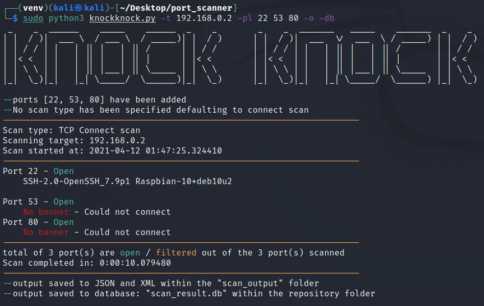
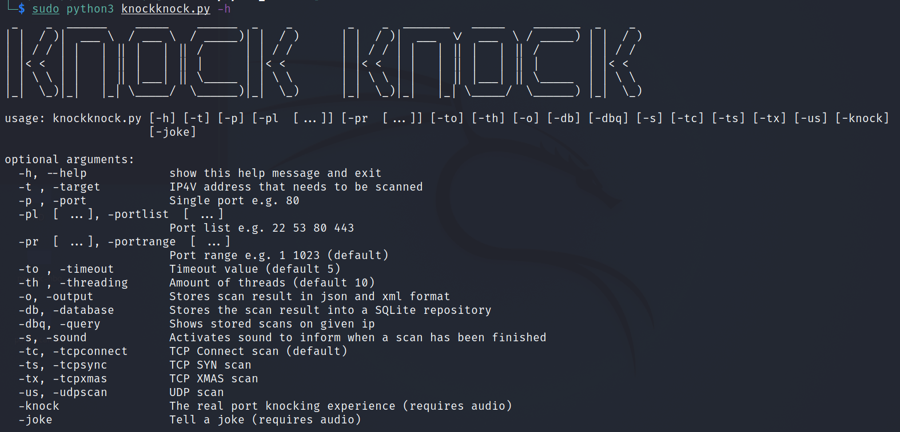

# port scanner

[github repository](https://github.com/loran-code/port_scanner/)

### Points of attention
- The programs makes use of the scapy library which requires root/admin priviliges to be run.
  
- The program needs the -t flag. It was first set to true but this would cause assertion errors within Linux so it's disabled.
  - When running the program supply `-h` flag for help or `-t <ip / hostname>` to run the program with basic settings
- Threading has not been implemented yet but can be given as terminal input. It does nothing "extra" right now but has not been disabled as it would break other parts in the code.
- within pycharm when querying the database with an ip that does not exist within the database the program "hangs".
  within a terminal this does not happen and will return a valid error
- Once the scans are running it's not always possible to CTRL + C out of the program.
  - Wait for the scan to finish
  - Close the terminal
  
- Code testing is below the required 70%. 
  - The project got quite big and with my little knowledge I am not skilled enough to apply test driven development.
  - Doing the testing afterwards has taken surprised me. The tests keep resulting in errors. for example when the test class tries to import the database class together with the connections it is trying to make it results in multiple errors.
  

### setup / install
In the supplied text file `requirements.txt` are the used  libraries and packages.
However, to my knowledge the amount of libraries is far greater than what is needed.
Install the required programs to your own knowledge.

The command `python3 -m pip freeze > requirements.txt` has been used to capture all used libraries / packages

My advice is to make a virtual environment and install the packages from the requirements.txt file
- step 1: `python3 -m venv path/to/new/virtual/environment`
- step 2: `change directory to the virtual environemt`
  - step 2.1: Linux `source bin/activate`
  - step 2.1: Windows `C:\> env\Scripts\activate.bat`
- step 3: `python3 -m pip install -r requirements.txt`
- step 4: `sudo python3 knockknock.py -h` for help menu
- step 5: `sudo python3 knockknock.py -t <ip or hostname of target` To run program with standard settings

#### Required flags
-t Specify the IP address of the target. Either a hostname or IP can be given.

#### Optional flags

-p give a single port to scan

-pl give a list of ports to scan. e.g. 22 53 80 443

-pr give a range of ports to scan. e.g. 1 100

-to Give wait time before program continues to the next port when no reply from the target port has been given

-th Not implemented yet

-o save scan output to json and xml format

-db save scan output to sqlite database

-dbq Query the database by entering an ip address

-s Program announces by voice when the scan is finished. requires sound on

-tc TCP connect scan

-ts TCP SYN scan

-tx TCP XMAS scan

-us UDP scan

-knock Play knocking sounds during the scan. The full immersive port knocking experience. requires sound

-joke Tell a network related joke. requires sound

#### Must
- unit testen
- test code on kali
